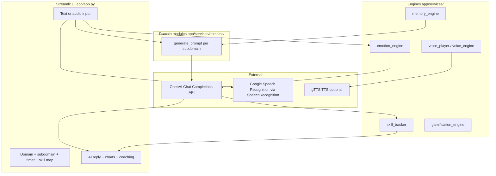

# Convo AI — architecture

This document explains how the application is wired end to end: from the Streamlit UI through domain modules to OpenAI and back through scoring, voice, and gamification.

## High-level diagram

## Request flow (one user turn)

1. **Session state** (`app/app.py`) holds XP, streak, skills, conversation turns, memory, timer, and daily goal progress. `init_state()` seeds defaults on first load.

2. **Sidebar** loads `learning_progression.json` from `data/` (or accepts an uploaded JSON). The user picks a **domain** (e.g. Political Science) and **subdomain** (e.g. Foundations of Political Theory). Domains are Python modules under `app/services/domains/`, loaded with `importlib.import_module`.

3. **Domain prompt** — `domain_module.generate_prompt(...)` returns a system-style prompt (and sometimes metadata) tailored to the subdomain. That string becomes the main **system** message for the chat completion.

4. **Context enrichment** — Before calling the model, the app may append:
   - Recent turn memory (last few user/AI exchanges)
   - Optional scenario context
   - Interruption behavior hints from `interruption_engine`
   - Tone observations from `personality_evolution`
   - Memory summary from `memory_engine`

5. **Multi-agent path** — If the user enables a panel, `multi_agent_engine.get_panel` builds separate system prompts per agent; each gets its own completion.

6. **Primary completion** — `OpenAI` client (`gpt-3.5-turbo` in code) returns the assistant reply. The app plays it with `voice_player.speak` (TTS).

7. **Parallel analysis** — A second completion uses `emotion_engine.evaluate_emotional_tone` (which returns a **prompt string** asking for JSON scores). The response is parsed into radar-chart data; `skill_tracker` updates rolling skill scores.

8. **Coaching and scoring** — Additional completions generate a one-line coaching tip (weakest trait), a numeric favorability score (`scoring_engine`), short feedback (`feedback_engine`), and optionally end-of-day reflection (`reflection_engine`).

9. **Gamification** — `gamification_engine.calculate_xp` and `check_streak` update XP and streak from scores and dates. Daily goal progress can trigger balloons and reflection UI.

10. **Persistence within session** — Memory is updated via `memory_engine.update_memory`. Export writes a plain-text transcript file for download.

## Directory roles

| Path | Role |
|------|------|
| `app/app.py` | Streamlit entrypoint: layout, orchestration, OpenAI calls |
| `app/services/` | “Engines”: prompts, scoring, emotion, memory, voice, gamification |
| `app/services/domains/` | One module per practice domain; each exposes `get_subdomains()` and `generate_prompt(...)` |
| `app/services/ui/` | Subdomain visual hints (gradients, labels) |
| `components/` | Reusable Streamlit UI: skill map, dashboards, charts |
| `data/` | JSON configs: `learning_progression.json`, `scenarios.json` |
| `streamlit/` | Optional Streamlit theme (`config.toml`) |
| `materials/` | Blog drafts, screenshots, PDFs — not required to run the app |

## Data files

- **`data/learning_progression.json`** — Skill tree / progression definition for the skill map UI. The app reads it from the **process working directory** (run Streamlit from the repository root so paths resolve).
- **`data/scenarios.json`** — Scenario definitions consumed by `scenario_engine` when scenarios are used.

## Configuration and secrets

- **`OPENAI_API_KEY`** — Loaded via `python-dotenv` from `.env`. Use `.env.example` as a template; never commit real keys.

## Dependencies worth noting

- **Streamlit** — UI and session state.
- **OpenAI Python SDK** — Chat completions.
- **SpeechRecognition** — Wraps Google Web Speech API for uploaded audio transcription (`voice_engine`).
- **gTTS** (see `requirements.txt`) — Used by `voice_player` if configured for cloud TTS.
- **matplotlib** — Progress / score line charts in the main app.

## Known implementation notes

- Model name is currently fixed in code (`gpt-3.5-turbo`). Changing models may require adjusting JSON parsing for emotion analysis.
- `st.experimental_rerun()` appears in the reset handler; newer Streamlit versions prefer `st.rerun()`.

For a file-by-file index of modules, see [MODULE_REFERENCE.md](MODULE_REFERENCE.md).
